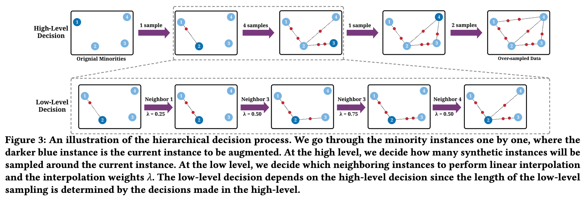

# [CIKM 2022] Towards Automated Over-Sampling for Imbalanced Classification
This is the implementation for the paper [Towards Automated Over-Sampling for Imbalanced Classification](https://arxiv.org/abs/2208.12433). We propose AutoSMOTE, an automated over-sampling algorithm for imbalanced classification. It jointly optimize different levels of decisions with deep hierarchical reinforcement learning. Please refer the paper for more details.


## Cite this Work
If you find this project helpful, please cite
```bibtex
@inproceedings{zha2022automated,
      title={Towards Automated Imbalanced Learning with Deep Hierarchical Reinforcement Learning}, 
      author={Daochen Zha and Kwei-Herng Lai and Qiaoyu Tan and Sirui Ding and Na Zou and Xia Hu},
      booktitle={CIKM},
      year={2022},
}
```

# Installation
Make sure that you have Python 3.6+ installed. Install with
```
pip3 install -r requirements.txt
pip3 install -e .
```

# Datasets
You don't need to mannually download datasets. Just pass the dataset name, and it will be automatically downloaded.

# Quick Start
Train on the Mozilla4 dataset with undersampling ratio of 100 and SVM as the base classifier:
```
python3 train.py
```

# Important Arguments
You can run AutoSMOTE under different configurations. Some important arguments are listed below.
*   `--dataset`: which dataset to use
*   `--clf`: which base classifeir to use
*   `--metric`: which metric to use
*   `--device`: by default it trains with GPU. Train with CPU by passing `cpu`
*   `--total_steps`: search budget
